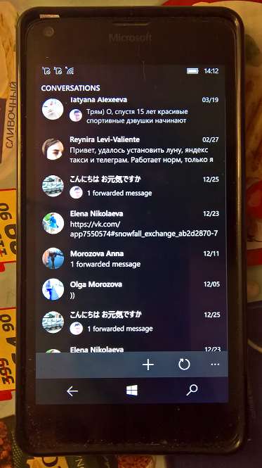

# Colibri

My fork of Artem Shuba's Colibri UWP App.

## Screenshot(s)

## My 2 cents

- Exception "8:Invalid request: versions below 5.81 are deprecated" fixed (I set vk version to 5.82).
- Min. os. win build downdraded to 10240 for better Astoria compatibility :)
- Tested (a little) at my Lumias (950, 640 DS and 640 with Astoria). All seems to be ok, over 7 (!) years. Artem is genious :)

## References
- https://github.com/artemshuba/ Great C# Developer
- https://github.com/artemshuba/Colibri/ The original Colibri project

## Cheers up,
m.e. 2022

